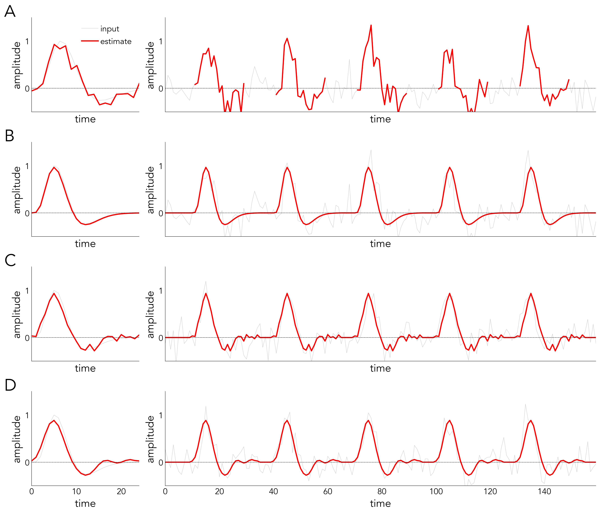
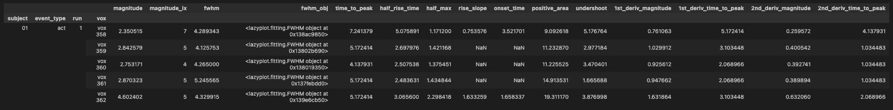

======================
HRF Estimation
======================

There are several ways of characterizing the HRF, each occupying a different place in the bias-variance spectrum:

- ``Epoching`` (panel A):

  The original method involves spacing out the events far from one another and averaging the responses around the stimulus onset. The advantage of this approach is that it closely resembles the data. The disadvantage, however, is that the events need to be spread out far enough to allow for the HRF to return to baseline. This means a large amount of events is needed to obtain enough statistical power, which translates into long sessions.

- ``Canonical HRF`` (and its derivatives):

  This method can be entered into the GLM to derive the optimal values to scale the basis sets with (panel B).
  Such an approach imposes tight restrictions on the shape (as only a single shape is permitted), which comes with the benefit of low variability.

- ``FIR``:

  A method with unlimited flexibility is called the ``finite impulse response`` (FIR) model (panel V). Here, each time point within a specified window around the stimulus onset is entered into the GLM as a regressor. Each regressor then models a specific part of the response shape, allowing maximum flexibility without any prior assumptions. Allowing such flexibility means that few data points contribute to each estimate. This inflates the variability of the estimates obtained using FIR models.

- ``Constrained basis sets``:

  These models lie somewhere in the middle and can be used to estimate response shapes (panel D). They allow more flexibility than the ``canonical HRF``, but have less variability compared to ``FIR``-models. Examples of such models include multiple ``sinusoidal curves`` or ``piece-wise linear`` functions.

**lazyfmri** supports multiple HRF estimation methods and extracts basic parameters from these curves:

