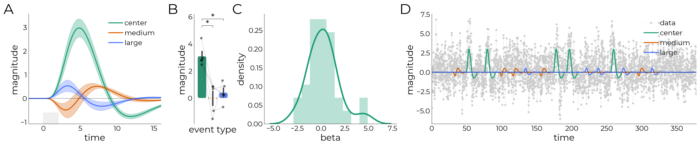

.. lazyfmri documentation master file, created by
   sphinx-quickstart.

====================================
lazyfmri | Utility Package for fMRI
====================================

**lazyfmri** is a utility package for ``pandas.DataFrame``-based fMRI analyses, including functions for GLMs, deconvolution, and plotting.
It is designed to be used in conjunction with the  `fmriproc <https://fmriproc.readthedocs.io/en/latest/index.html>`_-package.
Dataframes are indexed by ``subject``, ``session``, ``run``, and ``task``, making them friendly to be exported and used in statistical packages such as ``JASP`` or ``SPSS``.

.. toctree::
   :maxdepth: 2
   :caption: Contents

   installation
   functionalities
   io
   hrf_estimation
   plotting
   preprocessing

.. toctree::
   :maxdepth: 1
   :caption: Example gallery

   nbs/lazyfmri

.. toctree::
   :maxdepth: 1
   :caption: API
   
   classes/index
