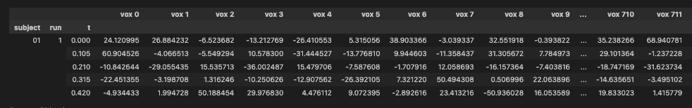
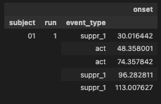

===================
I/O Functionalities
===================

The :doc:`Dataset <functionalities>` class can parse several fMRI file types:

Functional Files
----------------

- Supported formats: `*.mat`, `*.nii.gz`, `*.gii`
- Outputs a **2D DataFrame** indexed by subject/run/task IDs.
- Compatible with `BIDS <https://bids.neuroimaging.io/index.html>`_ format.

Experiment Files
----------------

Designed for `exptools2 <https://github.com/VU-Cog-Sci/exptools2>`_, this package can extract experiment phases.

Eyetracker Files
----------------

Supports `*.edf`-files from `EyeLink <https://www.sr-research.com/eyelink-1000-plus/>`_, using `hedfpy <https://github.com/tknapen/hedfpy>`_.
